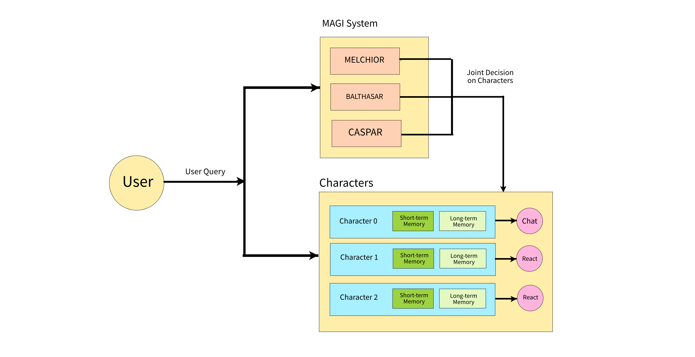

# Legion

This is a project to communicate with multiple characters played by AI through command line. Developed and tested on Windows.

The project is inspired by Mr.Robot, Legion, EVA and other works. 80% of the code is completed through Curosr + Claude 3.7 Sonnet.

## Design

## Prerequisites

1. Install Ollama https://ollama.com/
2. Run `ollama run llama3.1` to download llama3.1
3. Pull this repo
4. Run `pip install -r requirements.txt` to install dependencies
5. Run `python main.py` to start the program

## Commands
- `VERBOSE`: Toggle verbose mode to see detailed logs
- `TTS`: Toggle text-to-speech functionality
- `[MAGI]`: Activate the MAGI system (prefix your query with [MAGI])

## TODO
- Add personality for character
- Root characters should be above to see the entire conversation history
- Use asyncio to reduce latency
- Prompt tuning
